# 🤖 AI-Powered Offer Letter Generation System

[](https://ai-powered-offer-letter-generation-system-8vlvdxvrycaxfvpgnjhj.streamlit.app/)

An intelligent system that generates personalized offer letters for candidates based on HR policies, salary bands, and employee data using a Retrieval Augmented Generation (RAG) architecture. The system features an interactive Streamlit interface for easy document management, employee data handling, and offer letter creation.

📌 **Live Demo**: [Access the App](https://ai-powered-offer-letter-generation-system-8vlvdxvrycaxfvpgnjhj.streamlit.app/)

## ✨ Features

* **Interactive UI**: A user-friendly Streamlit application to manage the entire workflow.
* **Intelligent Document Processing**: Advanced chunking and processing for various document formats (`.pdf`, `.txt`, `.docx`).
* **Vector-based Search**: Utilizes FAISS for efficient similarity search across HR policy documents.
* **Dynamic Offer Letter Generation**: Creates personalized offer letters tailored to employee band, department, and specific policies.
* **HR Policy Chatbot**: An interactive chat interface to ask contextual questions about HR policies.
* **Data Management**: Easy upload and management of employee data via CSV files.
* **System Health & Monitoring**: Built-in status indicators and system diagnostics.

## ⚙️ How It Works

The system follows a RAG pipeline:

1. **Data Ingestion**: HR policy documents (e.g., leave, travel policies) and a sample offer letter are uploaded through the UI.
2. **Document Processing**: The `DocumentProcessor` chunks the documents into smaller, manageable pieces to prepare them for embedding.
3. **Vectorization**: The text chunks are converted into numerical vectors (embeddings) using a sentence transformer model.
4. **Indexing**: These embeddings are stored and indexed in a `FAISS` vector store for fast retrieval.
5. **Querying & Retrieval**: When generating an offer letter for a specific employee, the system retrieves the most relevant policy information from the vector store based on the employee's data (e.g., their band level).
6. **Generation**: The retrieved context, along with the employee's details, is fed into a Large Language Model (Gemini 1.5 Pro) which generates a personalized and contextually accurate offer letter.

## 🏍️ Architecture

```mermaid
graph TB
    subgraph "Input Sources"
        A1[📄 HR Policy Documents]
        A2[📋 Employee Data CSV]
        A3[📝 Offer Letter Templates]
    end

    subgraph "Processing Layer"
        B1[📝 Document Processor]
        B2[🔍 Text Chunking Engine]
        B3[🧮 Embedding Generator]
    end

    subgraph "Storage & Retrieval"
        C1[📚 FAISS Vector Store]
        C2[🗃️ Document Metadata]
        C3[🔎 Similarity Search Engine]
    end

    subgraph "AI Generation"
        D1[🤖 Gemini 1.5 Pro LLM]
        D2[📋 Context Assembler]
        D3[✨ Offer Letter Generator]
    end

    subgraph "User Interface"
        E1[🖥️ Streamlit Web App]
        E2[💬 HR Policy Chatbot]
        E3[📊 System Dashboard]
    end

    subgraph "Output"
        F1[📧 Personalized Offer Letters]
        F2[💬 Policy Q&A Responses]
        F3[📈 System Analytics]
    end

    A1 --> B1
    A2 --> B1
    A3 --> B1
    
    B1 --> B2
    B2 --> B3
    B3 --> C1
    B1 --> C2
    
    C1 --> C3
    C2 --> C3
    C3 --> D2
    
    D2 --> D1
    D1 --> D3
    D3 --> F1
    
    E1 --> B1
    E2 --> C3
    E2 --> D1
    E2 --> F2
    E3 --> F3
    
    D1 --> F2

    classDef inputStyle fill:#E3F2FD,stroke:#1976D2,stroke-width:2px
    classDef processStyle fill:#E8F5E8,stroke:#388E3C,stroke-width:2px
    classDef storageStyle fill:#FFF3E0,stroke:#F57C00,stroke-width:2px
    classDef aiStyle fill:#F3E5F5,stroke:#7B1FA2,stroke-width:2px
    classDef uiStyle fill:#FFEBEE,stroke:#C62828,stroke-width:2px
    classDef outputStyle fill:#E0F2F1,stroke:#00695C,stroke-width:2px

    class A1,A2,A3 inputStyle
    class B1,B2,B3 processStyle
    class C1,C2,C3 storageStyle
    class D1,D2,D3 aiStyle
    class E1,E2,E3 uiStyle
    class F1,F2,F3 outputStyle
```

<details> <summary>Click to expand diagram</summary>



</details>

## 🛠️ Technology Stack

* **Backend**: Python
* **Web Framework**: Streamlit
* **LLM**: Google Gemini 1.5 Pro
* **Vector Store**: FAISS (Facebook AI Similarity Search)
* **Embeddings**: `text-embedding-ada-002` (or other sentence transformers)
* **Data Handling**: Pandas

## 📁 Project Structure

```
offer_letter_system/
├── app.py
├── config/
│   └── settings.py
├── data/
│   ├── documents/
│   │   ├── embeddings/
│   │   │   ├── Employee_List.csv
│   │   │   └── HR Leave Policy.pdf
│   │   ├── leave_policy.txt
│   │   ├── sample_offer_letter.txt
│   │   └── travel_policy.txt
│   ├── embeddings/
│   │   ├── embeddings.pkl
│   │   ├── faiss_index.bin
│   │   └── index_stats.json
│   └── hr_documents/
├── LICENSE
├── README.md
├── requirements.txt
├── session_data.json
├── src/
│   ├── __init__.py
│   ├── cached_loaders.py
│   ├── document_processor.py
│   ├── llm_interface.py
│   ├── offer_generator.py
│   ├── utils.py
│   └── vector_store.py
└── templates/
    └── offer_template.py
```

## 🚀 Getting Started

### Prerequisites

* Python 3.8+
* A Google Gemini API Key

### Installation

1. **Clone the repository:**

   ```bash
   git clone https://github.com/codeMaestro78/AI-Powered-Offer-Letter-Generation-System.git
   cd offer_letter_system
   ```

2. **Create a virtual environment and activate it:**

   ```bash
   python -m venv venv
   source venv/bin/activate  # On Windows, use `venv\Scripts\activate`
   ```

3. **Install the required dependencies:**

   ```bash
   pip install -r requirements.txt
   ```

### Configuration

1. Create a `.env` file in the root directory of the project.
2. Add your Google Gemini API key to the file:

   ```env
   GEMINI_API_KEY="your_api_key_here"
   ```

### Usage

1. **Run the Streamlit application:**

   ```bash
   streamlit run app.py
   ```

2. **Open your browser** and navigate to the local URL provided by Streamlit (usually `http://localhost:8501`).

3. **Using the App:**

   * **Step 1: Upload Documents**: In the sidebar, upload your HR policy documents (PDF, TXT, DOCX) and the employee data CSV file.
   * **Step 2: Process Documents**: Click the `Process Documents` button. The system will parse the documents, create vector embeddings, and build the FAISS index.
   * **Step 3: Generate Offer Letters**: Once processing is complete, select an employee from the dropdown menu in the "Offer Letter Generation" tab. The system will automatically populate their details.
   * **Step 4: Customize and Generate**: Click `✨ Generate Offer Letter` to create the personalized letter.
   * **Step 5: Chat with Policies**: Use the "HR Policy Chatbot" tab to ask questions about the uploaded documents.

## 🤝 Contributing

Contributions are welcome! Please feel free to submit a pull request or open an issue for any bugs, feature requests, or improvements.

1. Fork the repository.
2. Create a new branch (`git checkout -b feature/YourFeature`).
3. Make your changes.
4. Commit your changes (`git commit -m 'Add some feature'`).
5. Push to the branch (`git push origin feature/YourFeature`).
6. Open a Pull Request.

## 📜 License

This project is licensed under the MIT License. See the `LICENSE` file for details.
